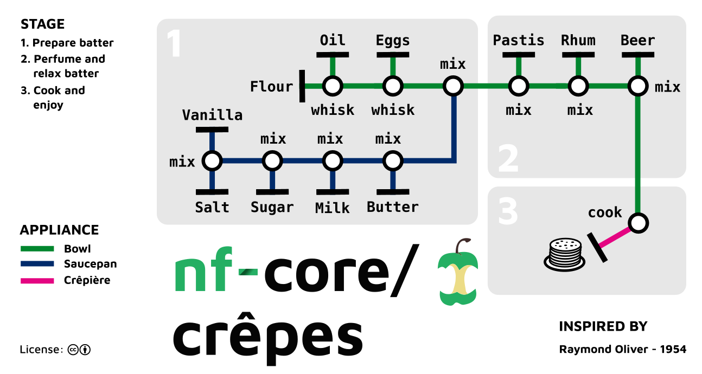

# nf-core/crepes


WE ARE THE ANCIENT STELLAR OBJECT IN THE SKY.
WE SERVE TO COUNT THE DAYS.
HOW MANY ARE WE?

OPEN ME.


[](https://www.nextflow.io/)
[](https://docs.conda.io/en/latest/)
[](https://www.docker.com/)
[](https://sylabs.io/docs/)

## Introduction

**nf-core/crepes** is a bioinformatics pipeline for the analysis of pancake and waffle sequencing data.

<p align="center">
    
</p>

## Pipeline summary

The pipeline performs the following steps:

1. **Import recipes** (`IMPORT_RECIPES`) - Load recipe metadata from cookbooks
2. **Mix batter** (`MIX_BATTER`) - Combine dry and wet ingredients with quality control
3. **Cook crepes** (`COOK_CREPES`) - Heat and transform batter into golden-brown crepes
4. **Plate and garnish** (`PLATE_GARNISH`) - Arrange and add toppings
5. **Taste test** (`TASTE_TEST`) - Run sensory evaluation and quality metrics

## Usage

```bash
nextflow run nf-core/crepes --input samplesheet.csv --outdir results -profile docker
```

## Credits

nf-core/crepes was originally written by MaxUlysse.
